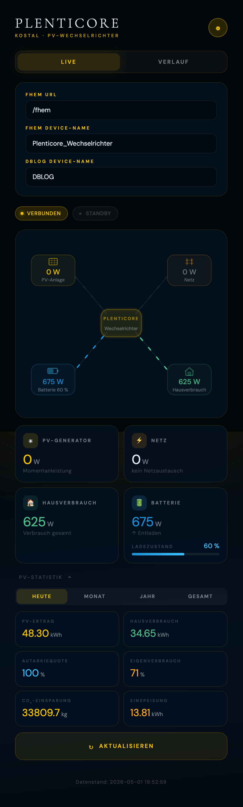
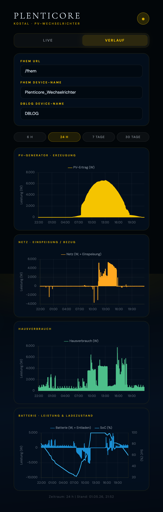

# 73_Plenticore.pm

FHEM-Modul für den **Kostal Plenticore Wechselrichter** – holt PV-Anlagendaten direkt über die lokale REST-API des Wechselrichters, ohne Cloud-Account oder Proxy-Server.

> Getestet mit: **Kostal Plenticore Plus** (mit und ohne Batterie)  
> Entwickelt als Ersatz für das bisherige Setup: `JsonMod` + MagicMirror-Modul [MMM-Plenticore](https://github.com/ChristophHermann/MMM-Plenticore) als JSON-API-Server

---

## Inhalt

- [Funktionsweise](#funktionsweise)
- [Voraussetzungen](#voraussetzungen)
- [Installation](#installation)
- [Einrichtung](#einrichtung)
- [Attribute](#attribute)
- [Set-Befehle](#set-befehle)
- [Get-Befehle](#get-befehle)
- [Internals](#internals)
- [Readings](#readings)
- [Beispiel-Konfiguration](#beispiel-konfiguration)
- [Webapp](#webapp)
- [Hintergrund: API-Flow](#hintergrund-api-flow)

---

## Funktionsweise

Das Modul verbindet sich direkt mit der **lokalen REST-API** des Plenticore Wechselrichters im Heimnetz. Kein Cloud-Account, kein externer Server.

Der Ablauf:

```
SCRAM-SHA-256-Login (3 Schritte) → Modul-Erkennung → Echtzeit-Prozessdaten → Readings schreiben
```

Die Authentifizierung erfolgt über das **SCRAM-SHA-256**-Protokoll (Salted Challenge Response Authentication Mechanism), dasselbe Verfahren das der Plenticore im Browser-Webinterface verwendet. Nach erfolgreichem Login wird eine Session-ID gespeichert. Bei `401`-Antworten loggt sich das Modul automatisch neu ein.

---

## Voraussetzungen

- FHEM ab Version 6.x
- Perl-Module:
  - `JSON` (meist vorhanden, sonst: `apt install libjson-perl`)
  - `Digest::SHA` (meist vorhanden, sonst: `apt install libdigest-sha-perl`)
  - `MIME::Base64` (Standard-Perl)
  - `Crypt::AuthEnc::GCM` aus dem **CryptX**-Paket für die SCRAM-Session-Einrichtung:
    ```bash
    apt install libcryptx-perl
    # oder alternativ:
    cpanm CryptX
    ```
- `HttpUtils` (FHEM-intern, immer vorhanden)
- Kostal Plenticore Wechselrichter im lokalen Netzwerk (HTTP, Port 80)
- Standard-Passwort `pvmaster` (Werkspasswort) oder ein individuell gesetztes Passwort

---

## Installation

1. `73_Plenticore.pm` in das FHEM-Modulverzeichnis kopieren:

```bash
cp 73_Plenticore.pm /opt/fhem/FHEM/
```

2. FHEM neu starten oder das Modul laden:

```
reload 73_Plenticore
```

3. *(Optional)* Webapp installieren:

```bash
cp -r www/plenticore /opt/fhem/www/
```

---

## Einrichtung

### 1. Device anlegen

IP-Adresse (und optional Port) des Wechselrichters angeben:

```
define Plenticore_Wechselrichter Plenticore 192.168.178.160
# oder mit explizitem Port:
define Plenticore_Wechselrichter Plenticore 192.168.178.160 80
```

### 2. Passwort setzen

Das Passwort wird **verschlüsselt** im internen FHEM-Schlüsselspeicher abgelegt und erscheint **nicht** in der Konfigurationsdatei. Das Werkspasswort lautet `pvmaster`:

```
set Plenticore_Wechselrichter password pvmaster
```

FHEM startet daraufhin automatisch den SCRAM-Login und beginnt mit dem Datenabruf.

### 3. Intervall konfigurieren

```
attr Plenticore_Wechselrichter interval 30
```

---

## Attribute

| Attribut | Standard | Beschreibung |
|---|---|---|
| `interval` | `30` | Abfrage-Intervall in Sekunden |
| `port` | `80` | HTTP-Port des Wechselrichters |
| `https` | `0` | `1` = HTTPS verwenden (selbstsigniertes Zertifikat wird akzeptiert) |
| `hasBattery` | auto | `1` = Batterie vorhanden (überschreibt Auto-Erkennung) |
| `pvStringCount` | auto | `1`, `2` oder `3` PV-Strings (überschreibt Auto-Erkennung) |
| `disable` | `0` | `1` = alle Abfragen deaktivieren |
| `disabledForIntervals` | – | Abfragen in Zeitbereichen deaktivieren, z.B. `23:00-06:00` |
| `stateFormat` | – | Freie Formatierung des STATE-Wertes (FHEM-Standard) |
| `event-on-change-reading` | – | Nur bei Wertänderung Events erzeugen |

---

## Set-Befehle

| Befehl | Beschreibung |
|---|---|
| `set <name> password <Passwort>` | Passwort verschlüsselt speichern und Login starten |
| `set <name> update` | Sofortigen Datenabruf anstoßen |
| `set <name> relogin` | Session zurücksetzen und neuen Login erzwingen |
| `set <name> Battery_MinSoc <0–100>` | Minimalen Batterieladezustand setzen (%) |
| `set <name> Battery_Strategy <0–2>` | Batterie-Strategie ändern (0=Auto, 1=Max. Eigenverbrauch, 2=Extern) |
| `set <name> Battery_ExternControl <0–2>` | Externe Batteriesteuerung (0=Aus, 1=Ladeleistung, 2=DC-Leistung) |
| `set <name> Battery_ExternControl_Power <W>` | Vorgabe externe Ladeleistung/DC-Leistung (W) |

> Die Batterie-Set-Befehle sind nur verfügbar wenn `hasBattery = 1` (automatisch erkannt oder manuell gesetzt).

---

## Get-Befehle

| Befehl | Beschreibung |
|---|---|
| `get <name> update` | Sofortigen Datenabruf anstoßen |
| `get <name> settings` | Wechselrichter-Konfiguration abrufen und als Readings speichern |

---

## Internals

| Internal | Beschreibung |
|---|---|
| `API_LAST_MSG` | Letzter HTTP-Status-Code (200 = OK) |
| `API_LAST_RES` | Unix-Timestamp des letzten erfolgreichen Abrufs |
| `NEXT` | Zeitpunkt des nächsten geplanten Abrufs |
| `PC_HAS_BATTERY` | `1` wenn Batterie erkannt |
| `PC_PV_STRING_COUNT` | Anzahl erkannter PV-Strings (1–3) |
| `SOURCE` | API-Endpunkt + letzter HTTP-Status |
| `VERSION` | Modulversion |

---

## Readings

### Echtzeit-Leistungswerte

| Reading | Einheit | Beschreibung |
|---|---|---|
| `PvGenerator` | W | PV-Generatorleistung gesamt (Summe aller Strings) |
| `Inverter` | W | Wechselrichter AC-Ausgangsleistung |
| `HomeConsumption` | W | Hausverbrauch gesamt |
| `Grid` | W | Netzaustausch: **positiv** = Einspeisung, **negativ** = Bezug |
| `Battery` | W | Batterieleistung: **positiv** = Entladung, **negativ** = Ladung |
| `Battery_SoC` | % | Batterieladezustand |
| `Battery_U` | V | Batteriespannung |
| `Battery_I` | A | Batteriestrom |
| `Battery_Cycles` | – | Anzahl Ladezyklen |

### PV-String-Werte

| Reading | Einheit | Beschreibung |
|---|---|---|
| `pv1_P` | W | Leistung String 1 |
| `pv1_U` | V | Spannung String 1 |
| `pv1_I` | A | Strom String 1 |
| `pv2_P` | W | Leistung String 2 (wenn vorhanden) |
| `pv3_P` | W | Leistung String 3 (wenn vorhanden) |

### AC-Phasenwerte

| Reading | Einheit | Beschreibung |
|---|---|---|
| `ac_L1_P` / `ac_L2_P` / `ac_L3_P` | W | Wirkleistung je Phase |
| `ac_L1_U` / `ac_L2_U` / `ac_L3_U` | V | Spannung je Phase |
| `ac_L1_I` / `ac_L2_I` / `ac_L3_I` | A | Strom je Phase |
| `ac_Frequency` | Hz | Netzfrequenz |
| `ac_CosPhi` | – | Leistungsfaktor |

### Statistik-Readings

Für jeden Zeitraum `Day`, `Month`, `Year` und `Total`:

| Reading | Einheit | Beschreibung |
|---|---|---|
| `Statistic_Yield_{T}` | kWh | PV-Ertrag |
| `Statistic_EnergyHome_{T}` | kWh | Hausverbrauch gesamt |
| `Statistic_EnergyHomePv_{T}` | kWh | Hausversorgung aus PV |
| `Statistic_EnergyHomeBat_{T}` | kWh | Hausversorgung aus Batterie |
| `Statistic_EnergyHomeGrid_{T}` | kWh | Hausversorgung aus Netz |
| `Statistic_Autarky_{T}` | % | Autarkiequote |
| `Statistic_OwnConsumptionRate_{T}` | % | Eigenverbrauchsquote |
| `Statistic_CO2Saving_{T}` | kg | CO₂-Einsparung |

Beispiel: `Statistic_Yield_Day`, `Statistic_Autarky_Month`, `Statistic_CO2Saving_Total`

### System-Readings

| Reading | Beschreibung |
|---|---|
| `hasBattery` | `1` wenn Batterie erkannt, `0` sonst |
| `pvStringCount` | Anzahl erkannter PV-Strings |
| `lastUpdate` | UTC-Zeitstempel des letzten Abrufs |

---

## Beispiel-Konfiguration

```perl
# Device anlegen (IP des Plenticore im lokalen Netz)
define Plenticore_Wechselrichter Plenticore 192.168.178.160

# Passwort einmalig setzen – erscheint NICHT in fhem.cfg:
# set Plenticore_Wechselrichter password pvmaster

attr Plenticore_Wechselrichter alias Plenticore Wechselrichter
attr Plenticore_Wechselrichter interval 30
attr Plenticore_Wechselrichter group Energie
attr Plenticore_Wechselrichter room 90_System_PvAnlage

attr Plenticore_Wechselrichter event-on-change-reading PvGenerator,Inverter,Battery,Battery_SoC,HomeConsumption,Grid
attr Plenticore_Wechselrichter event-on-update-reading PvGenerator,Inverter,Battery,Battery_SoC,HomeConsumption,Grid

attr Plenticore_Wechselrichter stateFormat {
  my $pv  = ReadingsVal($name, "PvGenerator",    "--");;
  my $inv = ReadingsVal($name, "Inverter",        "--");;
  my $bat = ReadingsVal($name, "Battery",         "--");;
  my $soc = ReadingsVal($name, "Battery_SoC",    "--");;
  my $hom = ReadingsVal($name, "HomeConsumption", "--");;
  my $grd = ReadingsVal($name, "Grid",            "--");;
  "PV-Anlage: $pv W | Wechselrichter: $inv W | Hausverbrauch: $hom W | Netz: $grd W | Batterie: $bat W | Batterieladung: $soc %"
}
```

> **Hinweis:** Das Reading-Format ist identisch zum bisherigen `JsonMod`-Setup – SVG-Plots und DbLog-Definitionen funktionieren ohne Änderungen weiter.

---

## Webapp

Unter `www/plenticore/index.html` liegt eine vollständige Single-File-Webapp mit:

- **Energie-Fluss-Diagramm** (SVG): Zeigt den Leistungsfluss zwischen PV, Wechselrichter, Netz, Haus und Batterie in Echtzeit – mit animierten Pfeilen je nach Flussrichtung
- **Wert-Karten**: PV-Leistung, Netzbezug/-einspeisung, Hausverbrauch, Batterieladung/-entladung
- **Batterieladezustand** mit grafischem Balken (wird ausgeblendet wenn keine Batterie vorhanden)
- **PV-Statistik** (aufklappbar): Heute / Monat / Jahr / Gesamt mit Ertrag, Autarkie, Eigenverbrauch und CO₂-Einsparung
- **Verlaufs-Charts** (Tab): PV-Ertrag, Netz, Hausverbrauch, Batterie über 6 h / 24 h / 7 Tage / 30 Tage aus DbLog

 

### Webapp installieren

```bash
cp -r www/plenticore /opt/fhem/www/
```

Aufruf im Browser:

```
http://<fhem-ip>:8083/fhem/www/plenticore/index.html
```

Beim ersten Aufruf über das Einstellungs-Icon (⚙) konfigurieren:
- **FHEM URL**: z.B. `/fhem` (selber Host) oder `http://192.168.178.x:8083/fhem`
- **FHEM Device-Name**: `Plenticore_Wechselrichter` (oder eigener Name)
- **DbLog Device-Name**: `DBLOG` (für den Verlaufs-Tab)

Die Einstellungen werden im Browser-`localStorage` gespeichert.

---

## Hintergrund: API-Flow

Das Modul repliziert den API-Ablauf des [MMM-Plenticore](https://github.com/ChristophHermann/MMM-Plenticore) MagicMirror-Moduls, der durch Code-Analyse des `node_helper.js` (dort: `kostal.js` + Login-Routinen) ermittelt wurde.

### SCRAM-SHA-256 Authentifizierung

```
POST /api/v1/auth/start
  Body: { username: "user", nonce: "<base64-zufalls-nonce>" }
  → Response: { transactionId, nonce: "<server-nonce>", salt, rounds }

POST /api/v1/auth/finish
  Body: { transactionId, proof: "<base64-client-proof>" }
  Berechnung:
    SaltedPassword = PBKDF2(password, base64decode(salt), rounds, 32)
    ClientKey      = HMAC-SHA256(SaltedPassword, "Client Key")
    StoredKey      = SHA256(ClientKey)
    AuthMessage    = "n=user,r={cnonce},r={serverNonce},s={salt},i={rounds},c=biws,r={serverNonce}"
    ClientProof    = ClientKey XOR HMAC-SHA256(StoredKey, AuthMessage)
  → Response: { token, signature }

POST /api/v1/auth/create_session
  SessionKey = HMAC-SHA256(SHA256(ServerKey), "Session Key" || AuthMessage || ClientKey)
  token verschlüsselt mit AES-GCM (SessionKey)
  Body: { transactionId, iv, tag, payload }
  → Response: { sessionId }

Alle weiteren Requests: Header "Authorization: Session <sessionId>"
```

### Datenabruf

```
GET  /api/v1/modules
  → Erkennung verfügbarer Module (Batterie, PV-String-Anzahl)

POST /api/v1/processdata
  Body: [ { moduleid: "devices:local", processdataids: ["Home_P", ...] },
          { moduleid: "devices:local:ac", processdataids: ["L1_P", ...] },
          { moduleid: "devices:local:battery", processdataids: ["SoC", "P", ...] },
          { moduleid: "devices:local:pv1",     processdataids: ["P", "U", "I"] },
          { moduleid: "scb:statistic:EnergyFlow", processdataids: ["Statistic:Yield:Day", ...] } ]
  → Array von { moduleid, processdata: [ { id, unit, value }, ... ] }

POST /api/v1/auth/logout
  (bei Modul-Undef)
```

### Leitungswert-Ableitung

| Reading | Berechnung |
|---|---|
| `PvGenerator` | Summe `pv1:P + pv2:P [+ pv3:P]` |
| `Inverter` | Summe `ac:L1_P + L2_P + L3_P` |
| `Grid` | `Inverter − HomeConsumption` (positiv = Einspeisung) |

---

## Lizenz

GPL v2 – siehe [LICENSE](LICENSE)

## Autor

Markus Eckert · [github.com/eckonator](https://github.com/eckonator)

---

## Verwandte Module / Links

- [73_FroelingConnect.pm](README.md) – FHEM-Modul für die Fröling Pelletheizung
- [MMM-Plenticore](https://github.com/ChristophHermann/MMM-Plenticore) – MagicMirror-Modul (Grundlage der API-Analyse)
- [Kostal Developer Portal](https://www.kostal-solar-electric.com/) – Offizielle Kostal-Dokumentation
